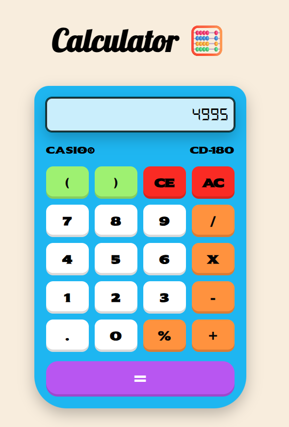

# Calcify

Calcify is a simple calculator web application built using React. It supports basic arithmetic operations with a clean and responsive user interface.

## Features
- Addition, subtraction, multiplication, division, and percentage calculations
- Parentheses support for correct order of operations
- Clear (`AC`) and backspace (`CE`) functionality
- Real-time input and result display

## Tech Stack
- React
- JavaScript
- CSS

## Getting Started

### Clone the repository
```bash
git clone https://github.com/Athulkrishna-a/Calcify.git
```

###Install dependencies
```bash
npm install
```
###Run the application
```bash
npm start
```

#### Open http://localhost:3000 in your browser.

## File Structure
- `Calculate.js` – Main calculator component
- `App.js` – Root component
- `index.js` – Application entry point
- `App.css` – Styling for the calculator UI

## Notes
- The calculator uses JavaScript `eval()` for expression evaluation. This is acceptable for a controlled learning project but **not recommended for production applications**.
- Built to practice React state management, event handling, and component-based UI design.

## Screenshot



